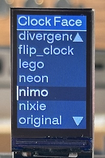

# eSPI_Menu

A menu system for TFTs that uses the TFT_eSPI library

# Description

Provides a one-level menu that provides:

* A title
* Items
  * The number of items can exceed the number of items that can be displayed at once.
  * The display will scroll as the you move the current selection up and down.
  * Arrows will indicate if there are more items to see.
  * Items can be regular, disabled or selected. Disabled items will never be selected.
* Both the title and items can have a border, label padding and (obviously?) a label.
* Separate color palettes can be defined for the title and the items, and for the border, padding, the label and for selected, unselected and disabled items.
* Separate fonts can be specified for the title and the menu items.
* Labels are clipped to the space available to draw them.

# Usage

Use as follows:

1. Create an instance of eSPI_Menu, passing in a pointer to a TFT_eSPI instance. This could be a sprite.
2. Configure the title spec and the item spec to provide things such as:
   1. Selected, unselected and disabled palettes for borders, padding and text.
   2. Left, right, top and bottom border sizes and padding sizes.
   3. Font.
3. Add items, specifying which item will be selected when the menu is drawn.
4. Call _show()_. If you're using a sprite, remember to push it.
5. Provide some means for the user to navigate the menu, you are responsible for calling the _up()_ and _down()_ methods (and pushing the menu if you're drawing into a sprite), but the menu class will make sure that:
   1. You can't go beyond the top and bottom of the menu.
   2. Scrolling the menu to fit the selected item in the space available,
   3. Skipping disabled items, drawing the scroll arrows if any.
6. Provide some means for the user to exit the menu. Nothing special here, just overwrite the display with whatever you normally display.
7. If you re-use the menu for different contents, or you change the contents, call reset() before you modify it and then fully re-initialize the contents.
